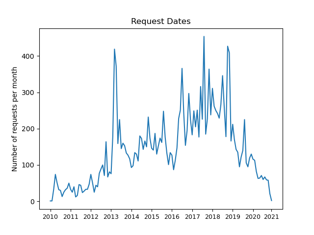

# Predicting Success of Freedom of Information Act Requests

_________________________

## Table of Contents
_________________________

1. [Background](#background)
2. [Data](#data)
    * [Using the API](#using-the-api)
    * [Preprocessing](#preprocessing)
3. [Exploratory Data Analysis](#exploratory-data-analysis)
4. [Hypothesis Testing](#hypothesis-testing)
    * [Digging Deeper](#digging-deeper)
        * [Two Rooks v. Queen](#two-rooks-v.-queen)
        * [Bishop pair v. Knight pair](#bishop-pair-v.-knight-pair)
        * [Knight & Bishop v. Rook & Pawn](#knight-&-bishop-v.-rook-&-pawn)
5. [Sources and Further Reading](#sources-and-further-reading)

    

## Background
The Freedom of Information Act (FOIA) was signed into law in 1967, and it requires government agencies to fully or partially disclose previously unreleased information upon request. There are 9 current exemptions that address issues of security and personal rights. It was initially targeted to improve government transparency with businesses and media, but recently law firms and individuals have been the most frequent users. FOIA has been amended, reformed, or expanded 8 times since its inception, and it can be difficult for a private citizen to know whether their request will be accepted or rejected. The goal is to use publicly available past FOIA requests to create a text classifier that can let a potential requester estimate their probability of success before submission.

## Data

### Using the API
MuckRock is a collaborative news site whose goal is to make politics more transparent and democracies more informed. They have a free [API](https://www.muckrock.com/api/) where you can access their FOIA request data programmatically. It is rate-limited at one page (50 requests) per second, and there are 19004 labelled federal FOIA requests, so it will take at least 6 minutes to download the requests. Code to do so is provided in the source folder (src/export_foia_to_mongo.py), but you must edit the credentials.py file to include your personal access token.

### Preprocessing
Each FOIA request contains many communications between requester and agency, but *a priori* our model only sees the initial request, so the code creates a new 'body' field and discards the rest of the communications.

The requests are loaded into MongoDB using the `mongo` Docker image. The body of the request is vectorized with scikit-learn's TfidfVectorizer, and the request agency is added as a feature to the transformed corpus to create our feature matrix.

_________________________

## Exploratory Data Analysis
Thanks to MuckRock's API and our choice of preprocessing, the dataset is clean and complete. Looking into request bodies at random, I saw similar phrasing with around 200-300 words in each request body (though some were longer). I also hunted for interesting FOIA requests, and found fan mail from J. Edgar Hoover, a death threat letter to Roberto Clemente that was opened 2 months <strong>after</strong> the attack was supposed to have happened, and rejected vanity plates:

 

 

    

 
 

Before examining the body of the requests, I wanted to check the metadata for any interesting patterns or features. I started with constructing a time series of FOIA request volume, hoping to identify a trend or seasonality:

 

    

 
 

Unfortunately I wasn't able to identify a clear trend or seasonality, but I was able to tell (by cross-referencing FOIA history) that many requests are driven by political and media events. In 2013, the Associated Press found that Gov’t employees were aliasing emails and sending correspondence under fake names to undermine transparency. Agencies were charging $1M and more for a FOIA request fulfillment at this time. November 2016 was the Presidential Election. 2018 was a record-breaking year for FOIA requests filed by individuals. These all line up with the spikes in the graph.

 

Next is the agency of which the request was made, both request volume:

 

    

 
 

`N/A` means that the agency listed did not show up in MuckRock's reference list, possibly because it does not receive enough requests or attention to merit its own entry. `State` refers to the U.S. State Department.

From the first graph, we can see that the FBI handles by far the most FOIA requests, and that the top 10 agencies as shown here handle about 50% of the overall request volume.

I was also interested in the request result by agency:

 

    

 
 

In the leftmost stacked bar we can see the class balance: 'Complete', 'No Relevant Documents', and 'Rejected' are relatively balanced, with 'Fix Required' and 'Partially Complete' classes being much smaller than the others. This informed my decision later on to use weighted F1 score as the model metric.

 The CIA is the least transparent, with the highest rejection rate and lowest full completion rate, followed by the NSA and FBI. The NSA has the second highest rejection rate, and the FBI has the highest rate of document redaction. The FCC and FTC show the highest completion rates and are the most transparent of these top 10 agencies. These patterns suggest that the agency will be an important feature of the classifier in the future. 

_________________________

## Model Fitting

I fit 4 classifiers: Softmax, k-Nearest Neighbors, Random Forest, and LightGBM. This last classifier is a type of Gradient Boosted classifier that has sophisticated algorithms for clever regularization and is able to handle categorical data without one-hot encoding.

Handling of categorical data was particularly important for me, because the agency feature is categorical but has thousands of categories -- too many to encode in a normal way. For the first 3 classifiers, I one-hot encoded the top 10 agencies, as well as a catch-all category for all other agencies.

The worse the class imbalance, the worse accuracy is as a metric, so I looked for other metrics to use to evaluate multi-class classifiers. For the case of a private citizen checking their FOIA request before submitting it, falsely identifying a soon-to-be-successful request as 'Rejected' is punished in the same way as the opposite mistake: by loss of time. For this reason, I decided on weighted F1 score, which is calculated by determining a typical F1 score (2 * TP / (2 * TP + FP + FN)) for each of the 5 classes. They are combined by a weighted average, where a class' weight is equal to its fractional representation in the dataset. The model performance results are shown below:

 

| Model               	  | Weighted F1 Score | Accuracy      |
|--------------------	  |-----------    	  |----------     |
| Baseline (mode)         | 0.2378      	  | 0.4093        |
| Softmax                 | 0.2119      	  | 0.3533        |
| KNN               	  | 0.4782    	      | 0.4819        |
| Random Forest           | 0.5301            | 0.5531        |
| <b>LightGBM (after tuning)</b> | <b>0.7757</b>            | <b>0.7799</b>        |

 

 

Of these 4 models, LightGBM was by far the best-performing in cross-validation, so I used this model to run a cross-validated grid search and tune the hyperparameters. My final model had about 78% accuracy in predicting the FOIA request result, which is quite a bit higher than the baseline.
_________________________

### Feature Importances

LightGBM's built-in encoding of categorical variables meant that I wasn't concerned with the typical drawback of using mean information gain -- that continuous variables would have inflated importance. Here is the graph of the 10 most important features to the model:

 

    

 
 

As expected, the agency of request is the most important feature. After that, the TF/IDF values of frequently-occurring and formal words appear. This suggests to me that people who use a template or who have a lawyer draft their FOIA request have very different results than people who do not. This seems to be the number 1 predictor of success of the body of a FOIA request, though due to the hidden workings of the LightGBM model I can't say this with certainty.

___________________________________

## Conclusion and Next Steps

There are many avenues I'd like to further pursue with this project:

* Exploring NLP preprocessing: n-grams, lemmatization, part-of-speech tags
* One-vs-rest classifier for ‘rejected’ label; plot ROC and precision/recall curves
* Finding predictive words
    * Minimize target entropy over documents containing a specific word
    * Try these TF/IDF features as a dimensionality reduction technique
* Dimensionality reduction & topic modeling
    * Use PCA/SVD and NMF to try to identify impactful word combinations
    * After dimensionality reduction, attempt another KNN classification
* Deep Learning
    * Using BERT (contextual) / GloVe (no context) embeddings under a single-layer CNN

 

From this small study, I've gained a better understanding of the complexity of a machine learning project. At every step along the way -- preprocessing, model fitting, tuning -- I had to make practical and goal-oriented decisions. I came away with a great appreciation for the experience, and I'm excited to complete more ML projects to broaden my understanding of best practices to handle ambiguities that pop up!

___________________________________

## Sources and Further Reading

1. [Best Practices for Filing a FOIA Request](https://www.archives.gov/ogis/resources/ogis-toolbox/best-practices-for-foia-requesters/filing-a-foia-request)
2. [MuckRock Tips and Tricks](https://www.muckrock.com/project/foia-101-tips-and-tricks-to-make-you-a-transparency-master-234/)